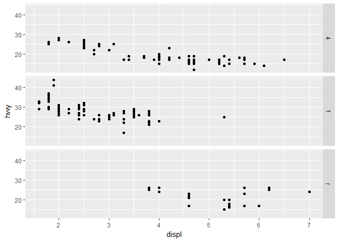

Plot Samples
================
Ray
June 12, 2017

Data Summary
------------

-   Categorical - manufacturer, model, trans, drv, fl, class
-   Continuous - displ, cyl, cty, hwy
-   Categorical variables are type chr, whereas continuous variables are type dbl or int

Plots
-----

``` r
ggplot(mpg, aes(displ, hwy, color = class)) + geom_point()
```


``` r
ggplot(mpg, aes(displ, hwy)) + geom_point() + facet_wrap(~ class, nrow =2)
```


``` r
ggplot(mpg, aes(displ, hwy)) + geom_point() + facet_wrap(~ class)
```


``` r
ggplot(mpg, aes(displ, hwy)) + geom_point() + facet_grid(drv ~ cyl)
```


``` r
ggplot(data = mpg) + 
  geom_point(mapping = aes(x = drv, y = cyl))
```


``` r
ggplot(data = mpg) + 
  geom_point(mapping = aes(x = displ, y = hwy)) +
  facet_grid(drv ~ .)
```


``` r
ggplot(data = mpg) + 
  geom_point(mapping = aes(x = displ, y = hwy)) +
  facet_grid(. ~ cyl)
```



``` r
ggplot(data = mpg, mapping = aes(x = displ, y = hwy)) + 
  geom_point() + 
  geom_smooth()
```

    ## `geom_smooth()` using method = 'loess'


``` r
ggplot(data = mpg, mapping = aes(x = displ, y = hwy)) + 
  geom_point(aes(color = class)) + 
  geom_smooth()
```

    ## `geom_smooth()` using method = 'loess'


``` r
ggplot(mpg, aes(x = displ, y = hwy)) + 
  geom_point(aes(color = class)) + 
  geom_smooth(data = filter(mpg, class == "subcompact"), se = FALSE)
```

    ## `geom_smooth()` using method = 'loess'


What geom would you use to draw a line chart? A boxplot? A histogram? An area chart?
------------------------------------------------------------------------------------

-   Line chart - geom\_line()
-   Boxplot - geom\_boxplot()
-   Histogram - geom\_histogram()
-   Area chart - geom\_area()

``` r
ggplot(data = mpg, mapping = aes(x = displ, y = hwy, color = drv)) + 
  geom_point() + 
  geom_smooth(se = FALSE)
```

    ## `geom_smooth()` using method = 'loess'


``` r
ggplot(data = mpg, mapping = aes(x = displ, y = hwy)) + 
  geom_smooth(aes(group = drv), se = FALSE) +
  geom_point()
```

    ## `geom_smooth()` using method = 'loess'


``` r
ggplot(data = mpg, mapping = aes(x = displ, y = hwy, color = drv)) + 
  geom_point() + 
  geom_smooth(se = FALSE)
```

    ## `geom_smooth()` using method = 'loess'


``` r
ggplot(data = mpg, mapping = aes(x = displ, y = hwy)) + 
  geom_point(aes(color = drv)) + 
  geom_smooth(se = FALSE)
```

    ## `geom_smooth()` using method = 'loess'


``` r
ggplot(data = mpg, mapping = aes(x = displ, y = hwy)) + 
  geom_point(size = 4, colour = "white") + 
  geom_point(aes(colour = drv))
```


``` r
ggplot(data = mpg, mapping = aes(x = displ, y = hwy)) + 
  geom_point(aes(color = drv)) +
  geom_smooth(aes(linetype = drv), se = FALSE)
```

    ## `geom_smooth()` using method = 'loess'


