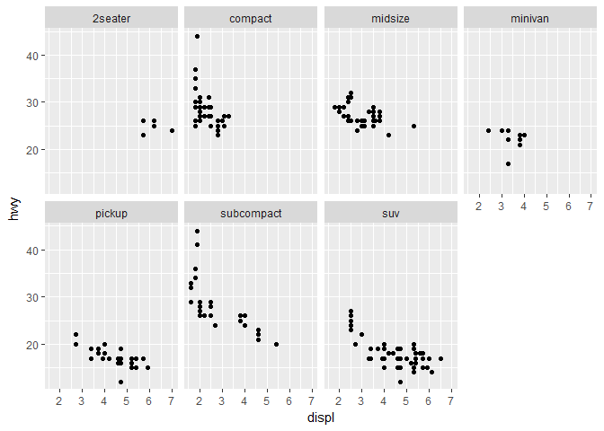
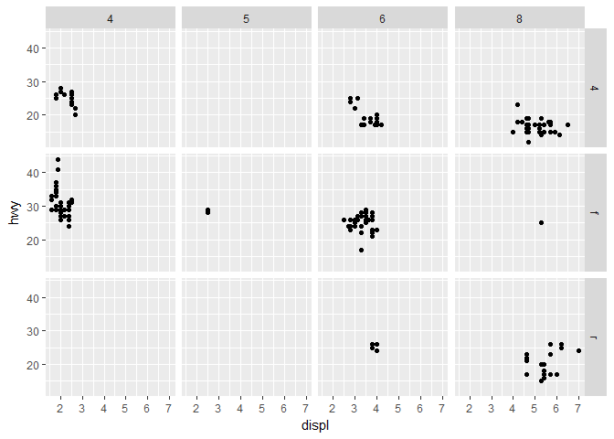

Plot Samples
================
Ray Zarkov
12/06/2017

#### Data Summary

-   Categorical - manufacturer, model, trans, drv, fl, class
-   Continuous - displ, cyl, cty, hwy
-   Categorical variables are type chr, whereas continuous variables are type dbl or int

<!-- -->

    ## Classes 'tbl_df', 'tbl' and 'data.frame':    234 obs. of  11 variables:
    ##  $ manufacturer: chr  "audi" "audi" "audi" "audi" ...
    ##  $ model       : chr  "a4" "a4" "a4" "a4" ...
    ##  $ displ       : num  1.8 1.8 2 2 2.8 2.8 3.1 1.8 1.8 2 ...
    ##  $ year        : int  1999 1999 2008 2008 1999 1999 2008 1999 1999 2008 ...
    ##  $ cyl         : int  4 4 4 4 6 6 6 4 4 4 ...
    ##  $ trans       : chr  "auto(l5)" "manual(m5)" "manual(m6)" "auto(av)" ...
    ##  $ drv         : chr  "f" "f" "f" "f" ...
    ##  $ cty         : int  18 21 20 21 16 18 18 18 16 20 ...
    ##  $ hwy         : int  29 29 31 30 26 26 27 26 25 28 ...
    ##  $ fl          : chr  "p" "p" "p" "p" ...
    ##  $ class       : chr  "compact" "compact" "compact" "compact" ...

#### Plots

``` r
ggplot(mpg, aes(displ, hwy, color = class)) + geom_point()
```


``` r
ggplot(mpg, aes(displ, hwy)) + geom_point() + facet_wrap(~ class, nrow =2)
```



``` r
ggplot(mpg, aes(displ, hwy)) + geom_point() + facet_grid(drv ~ cyl)
```



``` r
ggplot(data = mpg) + 
  geom_point(mapping = aes(x = displ, y = hwy)) +
  facet_grid(drv ~ .)
```


``` r
ggplot(data = mpg) + 
  geom_point(mapping = aes(x = displ, y = hwy)) +
  facet_grid(. ~ cyl)
```


``` r
ggplot(data = mpg, mapping = aes(x = displ, y = hwy)) + 
  geom_point() + 
  geom_smooth()
```


``` r
ggplot(data = mpg, mapping = aes(x = displ, y = hwy)) + 
  geom_point(aes(color = class)) + 
  geom_smooth()
```


``` r
ggplot(mpg, aes(x = displ, y = hwy)) + 
  geom_point(aes(color = class)) + 
  geom_smooth(data = filter(mpg, class == "subcompact"), se = FALSE)
```


#### What geom would you use to draw a line chart? A boxplot? A histogram? An area chart?

-   Line chart - geom\_line()
-   Boxplot - geom\_boxplot()
-   Histogram - geom\_histogram()
-   Area chart - geom\_area()

``` r
ggplot(data = mpg, mapping = aes(x = displ, y = hwy, color = drv)) + 
  geom_point() + 
  geom_smooth(se = FALSE)
```


``` r
ggplot(data = mpg, mapping = aes(x = displ, y = hwy)) + 
  geom_smooth(aes(group = drv), se = FALSE) +
  geom_point()
```


``` r
ggplot(data = mpg, mapping = aes(x = displ, y = hwy, color = drv)) + 
  geom_point() + 
  geom_smooth(se = FALSE)
```


``` r
ggplot(data = mpg, mapping = aes(x = displ, y = hwy)) + 
  geom_point(aes(color = drv)) + 
  geom_smooth(se = FALSE)
```


``` r
ggplot(data = mpg, mapping = aes(x = displ, y = hwy)) + 
  geom_point(size = 4, colour = "white") + 
  geom_point(aes(colour = drv))
```


``` r
ggplot(diamonds, aes(price, carat, color = cut)) + 
  geom_smooth(se = FALSE)
```


``` r
ggplot(data = mpg, mapping = aes(x = displ, y = hwy)) + 
  geom_point(aes(color = drv)) +
  geom_smooth(aes(linetype = drv), se = FALSE)
```


#### Diamonds Data Summary

    ## Classes 'tbl_df', 'tbl' and 'data.frame':    53940 obs. of  10 variables:
    ##  $ carat  : num  0.23 0.21 0.23 0.29 0.31 0.24 0.24 0.26 0.22 0.23 ...
    ##  $ cut    : Ord.factor w/ 5 levels "Fair"<"Good"<..: 5 4 2 4 2 3 3 3 1 3 ...
    ##  $ color  : Ord.factor w/ 7 levels "D"<"E"<"F"<"G"<..: 2 2 2 6 7 7 6 5 2 5 ...
    ##  $ clarity: Ord.factor w/ 8 levels "I1"<"SI2"<"SI1"<..: 2 3 5 4 2 6 7 3 4 5 ...
    ##  $ depth  : num  61.5 59.8 56.9 62.4 63.3 62.8 62.3 61.9 65.1 59.4 ...
    ##  $ table  : num  55 61 65 58 58 57 57 55 61 61 ...
    ##  $ price  : int  326 326 327 334 335 336 336 337 337 338 ...
    ##  $ x      : num  3.95 3.89 4.05 4.2 4.34 3.94 3.95 4.07 3.87 4 ...
    ##  $ y      : num  3.98 3.84 4.07 4.23 4.35 3.96 3.98 4.11 3.78 4.05 ...
    ##  $ z      : num  2.43 2.31 2.31 2.63 2.75 2.48 2.47 2.53 2.49 2.39 ...

``` r
ggplot(diamonds, aes(cut, fill = clarity)) +
  geom_bar()
```


-   If you don’t want a stacked bar chart, you can use one of three other options: "identity", "dodge" or "fill".

``` r
ggplot(diamonds, aes(cut, fill = clarity)) +
  geom_bar(alpha = 1/5, position = "identity")
```


``` r
ggplot(diamonds, aes(cut, color = clarity)) +
  geom_bar(fill = NA, position = "identity")
```


-   Position = "fill" works like stacking, but makes each set of stacked bars the same height. This makes it easier to compare proportions across groups.

``` r
ggplot(diamonds, aes(cut, fill = clarity)) +
  geom_bar(position = "fill")
```


-   Position = "dodge" places overlapping objects directly beside one another. This makes it easier to compare individual values.

``` r
ggplot(diamonds, aes(cut, fill = clarity)) +
  geom_bar(position = "dodge") 
```


-   Add randomness to plot for scale

``` r
ggplot(mpg, aes(displ, hwy)) +
  geom_jitter()
```


#### Coordinate Systems

-   coord\_flip() switches x and y axes. This is useful (for example), if you want horizontal boxplots. It’s also useful for long labels: it’s hard to get them to fit without overlapping on the x-axis.

``` r
ggplot(mpg, aes(class, hwy)) +
  geom_boxplot()
```


``` r
ggplot(mpg, aes(class, hwy)) +
  geom_boxplot() +
  coord_flip()
```


-   coord\_polar() uses polar coordinates. Polar coordinates reveal an interesting connection between a bar chart and a Coxcomb chart.

``` r
bar <- ggplot(diamonds, aes(cut, fill = cut)) +
  geom_bar(show.legend = FALSE, width = 1) +
  theme(aspect.ratio = 1) +
  labs(x = NULL, y = NULL)

bar + coord_flip()
```


``` r
bar + coord_polar()
```


``` r
# Turning a stacked bar chart into a pie chart using coord_polar().
ggplot(mpg, aes(factor(1), fill = class)) +
  geom_bar(width = 1) + 
  coord_polar(theta = "y")
```


``` r
ggplot(mpg, aes(cty, hwy)) + 
  geom_point() +
  geom_abline()
```


#### The layered grammer of graphics

``` r
 # ggplot(data = <DATA>) +     
 #    <GEOM_FUNCTION>(    
 #      mapping = aes(<MAPPINGS>),  
 #      stat = <STAT>,   
 #      position = <POSITION>  
 #    ) +  
 #    <COORDINATE_FUNCTION> +  
 #    <FACET_FUNCTION>
```
